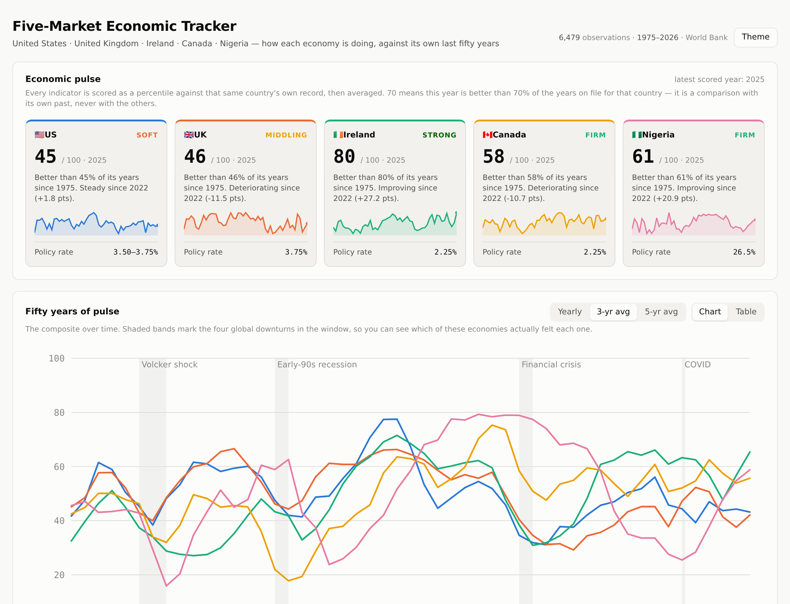

# Exchange Drop Monitor

A dashboard that watches the **New York Stock Exchange**, **Nasdaq** and the
**London Stock Exchange**, and surfaces the companies whose share price has
**fallen month on month**.

118 large caps are tracked out of the box (40 NYSE, 38 Nasdaq, 40 LSE). The
watchlists are plain JSON — add or remove companies as you like.


## Quick start

```bash
python3 fetch.py --provider stooq   # pull real prices (no API key needed)
python3 serve.py                    # then open http://127.0.0.1:8000/
```

Running `fetch.py` with no arguments builds a **demo** snapshot from synthetic
prices, so the dashboard works offline while you set things up. The page says so
in a banner whenever it is showing demo data.

Python 3.9+ is the only requirement. No pip installs, no build step, no
JavaScript toolchain.

> There is a second dashboard in this repo: the **[Five-Market Economic
> Tracker](#five-market-economic-tracker)**, which follows the US, UK, Ireland,
> Canada and Nigeria across fifty years of macroeconomic data.

## Two periods, one page

The **Compare** control at the top switches the whole dashboard between
**month on month** and **year on year**. Every number below it follows: the
summary tiles, the per-exchange comparison, the ranked chart, the minimum-drop
filter and the table's "from high" column. The table always carries both
changes side by side, so a company down on the month but up on the year is
visible at a glance.

Year on year compares the latest close against the same point 12 months
earlier (or, on the calendar basis, the last completed month against the same
month a year before). It needs a year of history: `fetch.py` pulls 500 days by
default, and any company with less than a year of prices is left out of the
year view rather than shown as flat. The page says so when that happens.

## What "month on month" means here

Two readings are supported, because mid-month they disagree:

| `--basis` | Compares | Use it when |
|---|---|---|
| `rolling` (default) | the latest close against the last close on or before the same day one month earlier | you want today's picture |
| `calendar` | the last close of the most recently completed month against the last close of the month before | you want the number that matches monthly reporting |

Markets are shut on weekends and holidays, so the comparison always falls back
to the last close **on or before** the target date rather than demanding an
exact-date match.

Year on year works the same way, 12 months back instead of one.

Alongside the headline number, each company gets:

- **Previous month** — the same calculation one month earlier, which is what
  drives the **▼▼ two months running** flag (down this month *and* last month).
- **3 months** — the quarter-long move, to separate a blip from a slide.
- **From 3-month high** — how far below its recent peak it now sits, and
  **from the 52-week high** in the year view.
- **Year on year** — the 12-month move, always present in the table.

## Price sources

```bash
python3 fetch.py --provider stooq        # free CSV, no key, covers US + LSE
python3 fetch.py --provider yahoo        # free JSON, no key, unofficial endpoint
python3 fetch.py --provider twelvedata   # needs TWELVEDATA_API_KEY
python3 fetch.py --provider demo         # synthetic, offline, not real prices
```

| Provider | Key | LSE | Notes |
|---|---|---|---|
| `stooq` | none | yes (`.uk` symbols) | Simplest live option. Rate-limits if hammered. |
| `yahoo` | none | yes (`.L` symbols) | Adjusted closes. Unofficial — can change without notice. |
| `twelvedata` | `TWELVEDATA_API_KEY` | yes (`TICKER:LSE`) | Free tier is 8 requests/minute, so a full run takes ~15 minutes. |
| `demo` | none | n/a | Deterministic fake prices for offline use. |

Each company carries a per-provider symbol in the watchlist files, so a provider
that names a ticker differently only needs an entry there:

```json
{
  "ticker": "BA.",
  "name": "BAE Systems plc",
  "sector": "Industrials",
  "exchange": "LSE",
  "currency": "GBX",
  "symbols": { "stooq": "ba.uk", "yahoo": "BA.L" }
}
```

Useful flags: `--exchanges LSE NYSE` to narrow the run, `--cache-hours 6` to
reuse recently fetched history (worth it on rate-limited providers),
`--limit 10` for a quick test, `--lookback-days 800` for more history, and
`--fail-under 90` to exit non-zero when a provider returns too little, so a
scheduled run can fall back to another one.

### A note on the live providers

The fetchers, their URL construction and their response parsing are covered by
tests that replay recorded payloads, but they were **written in an environment
with no outbound network access**, so they have never made a real call to
stooq, Yahoo or Twelve Data. Expect to shake out a wrinkle or two on the first
live run — start with `python3 fetch.py --provider stooq --limit 5` and check
the output before committing to a full run.

## Reading the dashboard

- **Filters** sit in one row and scope everything below them: exchange, minimum
  drop, sector, search, sort, "two months running only", and "show risers too".
- **The four tiles** summarise the current exchange/sector/search selection.
- **How much of each exchange is falling** compares all three exchanges side by
  side, so a company's fall can be read against its market.
- **The ranked bar chart** shows the steepest 25 on whichever measure the sort
  is set to — month on month, distance below the 3-month high, or the 3-month
  move — with the title and axis following along. Turn on *show risers too* and
  it becomes a zero-centred chart of the biggest moves in both directions.
- **Every tracked company** is the same data in full, sortable by any column,
  with a 3-month sparkline. Nothing is available only on hover.

Colours: falls are red, rises are green, and both always carry an arrow and a
signed number, so nothing depends on colour alone. Exchange hues were validated
for colour-blind separation in both light and dark themes. The theme follows
your system setting; the **Theme** button overrides it.

## A single shareable file

```bash
python3 export_html.py            # -> dist/dashboard.html
```

Inlines the stylesheet, the script and the current snapshot into one HTML file
with no external dependencies. It opens straight from disk, survives being
emailed, and can be dropped on any static host. It is a point-in-time copy —
rebuild it after each `fetch.py` run.

## Keeping it up to date

The dashboard reads `data/snapshot.json`. Rebuild it whenever you want fresh
numbers — the **Refresh** button re-reads the file without a page reload.

Daily, on a Mac or Linux box, after the London close (cron runs in local time):

```cron
30 17 * * 1-5 cd /path/to/this/repo && /usr/bin/python3 fetch.py --provider stooq --quiet
```

Or let GitHub do it: `.github/workflows/refresh-snapshot.yml` runs on weekdays
at 17:30 UTC, pulls live prices and commits the new snapshot. You can also run
it on demand from the repository's **Actions** tab. It tries stooq first and
falls back to Yahoo if too few companies come back, using `--fail-under` as the
gate:

```bash
python3 fetch.py --provider stooq --quiet --fail-under 90 \
  || python3 fetch.py --provider yahoo --quiet --fail-under 90
```

## Layout

```
fetch.py               build data/snapshot.json          (stock dashboard)
fetch_econ.py          build data/econ.json              (economic tracker)
serve.py               static server for both dashboards
export_html.py         bundle either one into a single shareable HTML file
stockmon/
  analysis.py          month-on-month and year-on-year maths (both bases)
  providers.py         stooq / yahoo / twelvedata / demo
  snapshot.py          orchestration, caching, error collection
  universe.py          watchlist loading and validation
econ/
  countries.py         the five markets and their central banks
  indicators.py        the indicator catalogue: unit, direction, coverage
  providers.py         World Bank API / demo, plus equity index levels
  pulse.py             percentile scoring and the composite (pure maths)
  snapshot.py          orchestration and error collection
universe/*.json        the tracked companies, per exchange
web/                   both dashboards (index.html + app.js, econ.html + econ.js)
data/snapshot.json     what the stock dashboard reads
data/econ.json         what the economic tracker reads
data/econ_context.json the hand-curated layer: policy rates, politics, IPOs
tests/                 113 tests, stdlib unittest
```

## Tests

```bash
python3 -m unittest discover -s tests
```

They cover the month-boundary edge cases (31 March → 28 February, year
crossings, missing trading days), both comparison bases, the year-on-year
comparison including the case where a company has less than a year of history,
every provider parser against recorded payloads, the URLs each provider builds,
and the full snapshot build over the real watchlists with a stubbed provider.

## Caveats worth knowing

- **LSE prices are in pence (GBX)**, and shown as `1,234.5p`. Percentage moves
  are currency-neutral, so the comparison across exchanges is still valid.
- **Percentage changes are price-only** — no dividends, and no adjustment for
  the effect of a stock split unless the provider supplies adjusted closes
  (Yahoo does; stooq's daily CSV is already split-adjusted).
- A company with less than a month of history is reported as an error in the
  banner rather than shown with a misleading number.
- The watchlists are a fixed selection of large caps, not full index membership,
  and they do not update themselves when an index is rebalanced.
- This is a monitoring tool, not investment advice.

---

# Five-Market Economic Tracker

A second dashboard, in the same repo and the same style: **how the US, UK,
Ireland, Canada and Nigeria are doing — measured against their own last fifty
years.**

```bash
python3 fetch_econ.py --provider worldbank   # real data, no API key needed
python3 serve.py                             # then open /web/econ.html
```



## The one idea it rests on

A raw number means nothing on its own. 3% inflation is good in Lagos and bad in
Ottawa; 6% unemployment is ordinary in Canada and alarming in Ireland. So the
tracker never shows you a bare figure and calls it good or bad. Every reading is
converted into a **percentile against that same country's own record** since
1975.

A score of 70 means *this year is better than 70% of the years on file for this
country*. That is a comparison with its own past — never with the other four.
A 70 in Nigeria and a 70 in Canada do not mean the two economies are equally
comfortable to live in.

Two things follow from that:

- **Direction is declared per indicator**, which is what lets unemployment
  falling and investment rising both count as "better". Inflation is scored on
  *distance from that central bank's own target* (2% for four of them, the
  midpoint of the CBN's 6–9% band for Nigeria), so deflation is penalised too.
- **A fifty-year composite becomes possible**, because the same transformation
  applies to every year in the series, not just the last one. That composite is
  the "pulse" line on the chart.

The pulse averages eight components with equal weights — GDP growth, GDP per
capita growth, inflation, unemployment, government debt, FDI, gross capital
formation and the current account. Equal weights because any other weighting
would be a hidden opinion about which part of an economy matters most.

## What it tracks

35 World Bank series per country, back to 1975, in eight families:

| Family | Examples |
|---|---|
| Growth & output | GDP growth, GDP per capita and its growth |
| Prices & rates | CPI inflation, lending rate, real rate, broad money |
| Labour market | Unemployment, youth unemployment, participation |
| Government & debt | Central government debt, net lending/borrowing, external debt |
| Investment flows | FDI (% of GDP and US$), portfolio equity, gross capital formation |
| Markets & business | Market cap, listed companies, turnover, new business density |
| Trade & external | Current account, exports, trade openness, reserves, FX rate |
| Political & institutional | The six Worldwide Governance Indicators, 1996 onwards |

Plus a **hand-curated layer** in `data/econ_context.json` — policy rates,
political situation, insolvency trends, IPO activity — because none of that
comes from one API covering all five markets. It is typed in, dated and sourced,
and the dashboard labels it as such.

```bash
python3 fetch_econ.py --context-only   # re-embed the curated layer, no network
```

## Reading it

- **Economic pulse** — the five cards, each with its 0–100 score, which
  direction it has moved in three years, a fifty-year sparkline and the current
  policy rate.
- **Fifty years of pulse** — the composite over time, with the Volcker shock,
  the early-90s recession, the financial crisis and COVID shaded in. Smoothing
  (yearly / 3-yr / 5-yr) is the difference between reading noise and reading a
  trend. Click a legend entry to hide a country; useful when Nigeria's inflation
  history flattens everyone else's line.
- **Indicator explorer** — any one of the 35 series across all five countries,
  with a ranked strip underneath showing where each country's latest reading
  sits *against its own history*.
- **Country detail** — every series a country has, as small multiples with a
  percentile badge on each.
- **Right now** — the curated layer, per country, with source links.
- **Method & coverage** — how the score works, what it will not tell you, and
  the exact years each series actually has.

Every chart has a table view, which is also how the page stays readable for the
three light-mode series colours that sit below 3:1 contrast.

## Keeping it current

`.github/workflows/refresh-econ.yml` runs weekly (Mondays, 06:15 UTC), and again
whenever the indicator catalogue or the curated context changes. It commits
`data/econ.json` if anything moved. World Bank series are annual and revise
slowly, so weekly is generous.

The run is guarded: `--fail-under 4000` refuses to commit a snapshot that came
back hollow, and the test suite asserts that the shipped snapshot is real data,
covers every country, reaches back to 1975, and had **no** indicator failures —
the governance series went silently missing exactly once, and that guard is why
it will not happen twice.

## A single shareable file

```bash
python3 export_html.py --dashboard econ      # -> dist/econ.html
```

One self-contained HTML file with the styles, the script and the whole snapshot
inlined. Opens from disk, survives email, drops on any static host.

## Caveats worth knowing

- **This is not a cross-country league table.** The score is explicitly
  relative to each country's own history. Comparing scores across countries
  compares each country to itself, not to the others.
- **Ireland's headline GDP and FDI are distorted** by multinational
  balance-sheet moves — the 2015 "leprechaun economics" spike is in the data.
  Modified domestic demand, in the curated panel, is the honest read.
- **Business closure has no comparable fifty-year cross-country series.** New
  business density starts in 2006; insolvency statistics are national and
  differently defined. The curated panel carries what exists.
- **IPO counts are not a World Bank series.** Listed-company count is the
  long-run proxy: a falling count means delistings are outpacing floats.
- **Governance scores start in 1996**, so they are a quarter of the window, not
  all of it.
- **The most recent year is often incomplete or revised**, and government debt
  is not reported for Ireland or Nigeria in this series — the coverage table
  shows exactly which years each country actually has.
