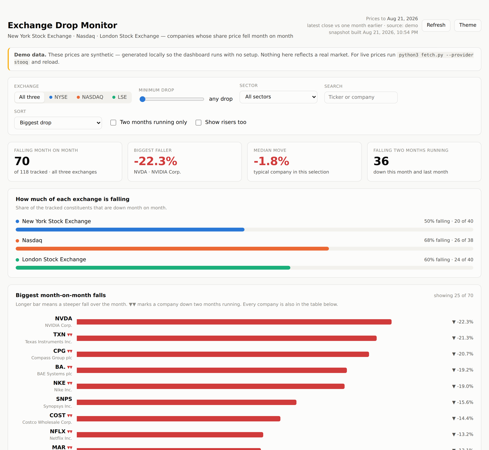

# Exchange Drop Monitor

A dashboard that watches the **New York Stock Exchange**, **Nasdaq** and the
**London Stock Exchange**, and surfaces the companies whose share price has
**fallen month on month**.

118 large caps are tracked out of the box (40 NYSE, 38 Nasdaq, 40 LSE). The
watchlists are plain JSON — add or remove companies as you like.



## Quick start

```bash
python3 fetch.py --provider stooq   # pull real prices (no API key needed)
python3 serve.py                    # then open http://127.0.0.1:8000/
```

Running `fetch.py` with no arguments builds a **demo** snapshot from synthetic
prices, so the dashboard works offline while you set things up. The page says so
in a banner whenever it is showing demo data.

Python 3.9+ is the only requirement. No pip installs, no build step, no
JavaScript toolchain.

## What "month on month" means here

Two readings are supported, because mid-month they disagree:

| `--basis` | Compares | Use it when |
|---|---|---|
| `rolling` (default) | the latest close against the last close on or before the same day one month earlier | you want today's picture |
| `calendar` | the last close of the most recently completed month against the last close of the month before | you want the number that matches monthly reporting |

Markets are shut on weekends and holidays, so the comparison always falls back
to the last close **on or before** the target date rather than demanding an
exact-date match.

Alongside the headline number, each company gets:

- **Previous month** — the same calculation one month earlier, which is what
  drives the **▼▼ two months running** flag (down this month *and* last month).
- **3 months** — the quarter-long move, to separate a blip from a slide.
- **From 3-month high** — how far below its recent peak it now sits.

## Price sources

```bash
python3 fetch.py --provider stooq        # free CSV, no key, covers US + LSE
python3 fetch.py --provider yahoo        # free JSON, no key, unofficial endpoint
python3 fetch.py --provider twelvedata   # needs TWELVEDATA_API_KEY
python3 fetch.py --provider demo         # synthetic, offline, not real prices
```

| Provider | Key | LSE | Notes |
|---|---|---|---|
| `stooq` | none | yes (`.uk` symbols) | Simplest live option. Rate-limits if hammered. |
| `yahoo` | none | yes (`.L` symbols) | Adjusted closes. Unofficial — can change without notice. |
| `twelvedata` | `TWELVEDATA_API_KEY` | yes (`TICKER:LSE`) | Free tier is 8 requests/minute, so a full run takes ~15 minutes. |
| `demo` | none | n/a | Deterministic fake prices for offline use. |

Each company carries a per-provider symbol in the watchlist files, so a provider
that names a ticker differently only needs an entry there:

```json
{
  "ticker": "BA.",
  "name": "BAE Systems plc",
  "sector": "Industrials",
  "exchange": "LSE",
  "currency": "GBX",
  "symbols": { "stooq": "ba.uk", "yahoo": "BA.L" }
}
```

Useful flags: `--exchanges LSE NYSE` to narrow the run, `--cache-hours 6` to
reuse recently fetched history (worth it on rate-limited providers),
`--limit 10` for a quick test, `--lookback-days 400` for more history, and
`--fail-under 90` to exit non-zero when a provider returns too little, so a
scheduled run can fall back to another one.

### A note on the live providers

The fetchers, their URL construction and their response parsing are covered by
tests that replay recorded payloads, but they were **written in an environment
with no outbound network access**, so they have never made a real call to
stooq, Yahoo or Twelve Data. Expect to shake out a wrinkle or two on the first
live run — start with `python3 fetch.py --provider stooq --limit 5` and check
the output before committing to a full run.

## Reading the dashboard

- **Filters** sit in one row and scope everything below them: exchange, minimum
  drop, sector, search, sort, "two months running only", and "show risers too".
- **The four tiles** summarise the current exchange/sector/search selection.
- **How much of each exchange is falling** compares all three exchanges side by
  side, so a company's fall can be read against its market.
- **The ranked bar chart** shows the steepest 25 on whichever measure the sort
  is set to — month on month, distance below the 3-month high, or the 3-month
  move — with the title and axis following along. Turn on *show risers too* and
  it becomes a zero-centred chart of the biggest moves in both directions.
- **Every tracked company** is the same data in full, sortable by any column,
  with a 3-month sparkline. Nothing is available only on hover.

Colours: falls are red, rises are green, and both always carry an arrow and a
signed number, so nothing depends on colour alone. Exchange hues were validated
for colour-blind separation in both light and dark themes. The theme follows
your system setting; the **Theme** button overrides it.

## Keeping it up to date

The dashboard reads `data/snapshot.json`. Rebuild it whenever you want fresh
numbers — the **Refresh** button re-reads the file without a page reload.

Daily, on a Mac or Linux box, after the London close (cron runs in local time):

```cron
30 17 * * 1-5 cd /path/to/this/repo && /usr/bin/python3 fetch.py --provider stooq --quiet
```

Or let GitHub do it: `.github/workflows/refresh-snapshot.yml` runs on weekdays
at 17:30 UTC, pulls live prices and commits the new snapshot. You can also run
it on demand from the repository's **Actions** tab. It tries stooq first and
falls back to Yahoo if too few companies come back, using `--fail-under` as the
gate:

```bash
python3 fetch.py --provider stooq --quiet --fail-under 90 \
  || python3 fetch.py --provider yahoo --quiet --fail-under 90
```

## Layout

```
fetch.py               build data/snapshot.json
serve.py               static server for the dashboard
stockmon/
  analysis.py          month-on-month maths (both bases)
  providers.py         stooq / yahoo / twelvedata / demo
  snapshot.py          orchestration, caching, error collection
  universe.py          watchlist loading and validation
universe/*.json        the tracked companies, per exchange
web/                   the dashboard (index.html, app.js, styles.css)
data/snapshot.json     what the dashboard reads
tests/                 52 tests, stdlib unittest
```

## Tests

```bash
python3 -m unittest discover -s tests
```

They cover the month-boundary edge cases (31 March → 28 February, year
crossings, missing trading days), both comparison bases, every provider parser
against recorded payloads, the URLs each provider builds, and the full snapshot
build over the real watchlists with a stubbed provider.

## Caveats worth knowing

- **LSE prices are in pence (GBX)**, and shown as `1,234.5p`. Percentage moves
  are currency-neutral, so the comparison across exchanges is still valid.
- **Percentage changes are price-only** — no dividends, and no adjustment for
  the effect of a stock split unless the provider supplies adjusted closes
  (Yahoo does; stooq's daily CSV is already split-adjusted).
- A company with less than a month of history is reported as an error in the
  banner rather than shown with a misleading number.
- The watchlists are a fixed selection of large caps, not full index membership,
  and they do not update themselves when an index is rebalanced.
- This is a monitoring tool, not investment advice.
